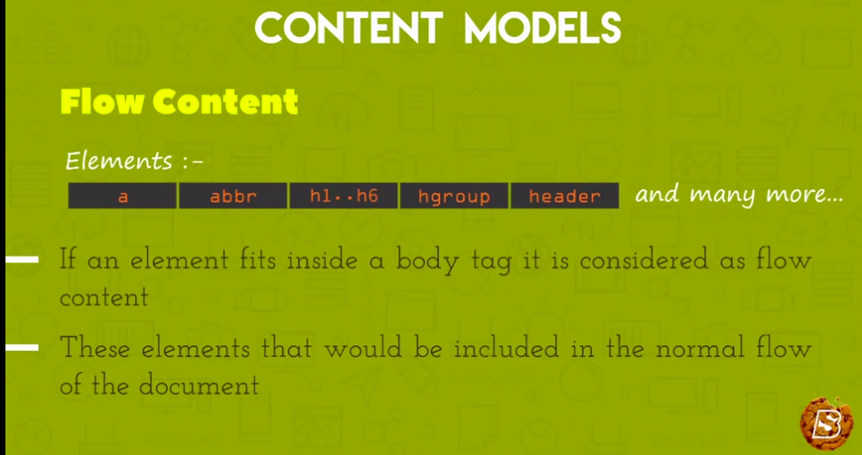

# Content Models

## HTML-4 Content Models

Had two content models which include:

## HTML-5 Content Models

Has content models which include:

1. Metadata Content Model
   

1. Metadata Content Model
   

1. Interractive Content Model
   

1. Heading Content Model
   

1. Phrasing Content Model
   

1. Flow Content Model
   

1. Sectioning Content Model
   

## Content Models Relationships

