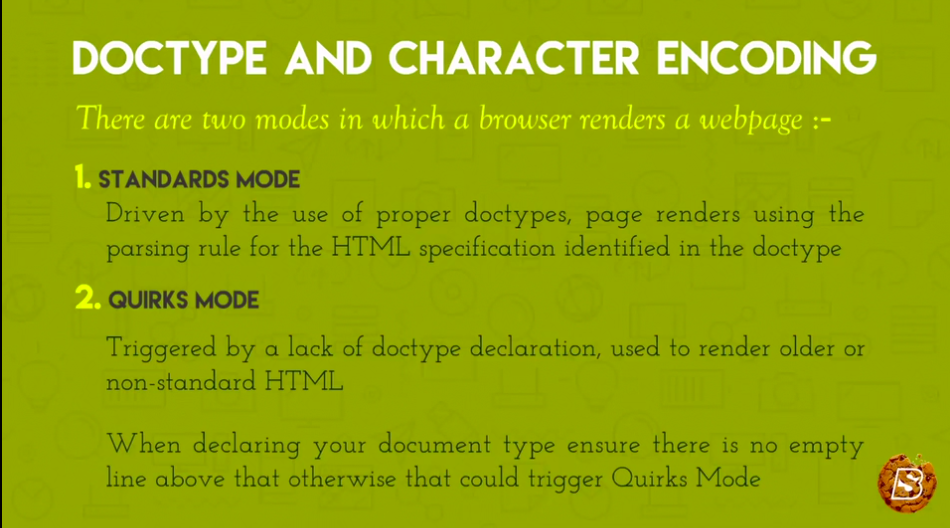
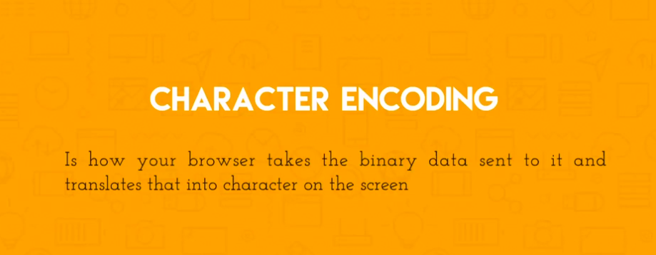

# Doctype and Character Encoding

The <!DOCTYPE html> declaration must come first in a html document and if preceded by a space or any other content it may trigger quirks mode.

The Character encoding defines how the broser translates the binary data it recieves into readbale content

