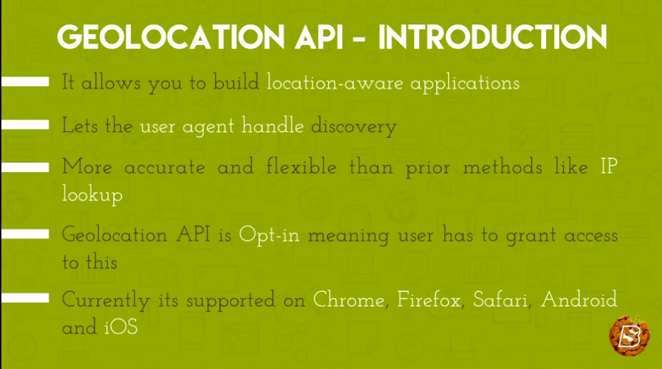
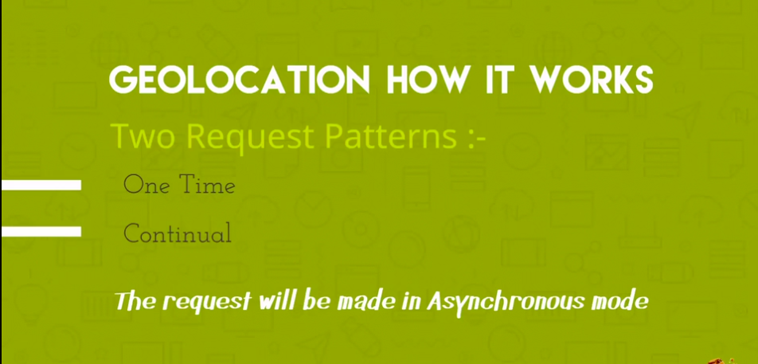
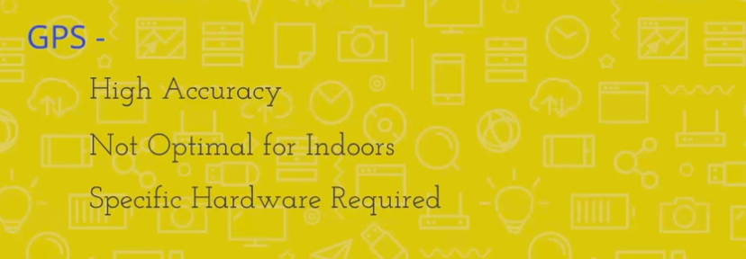
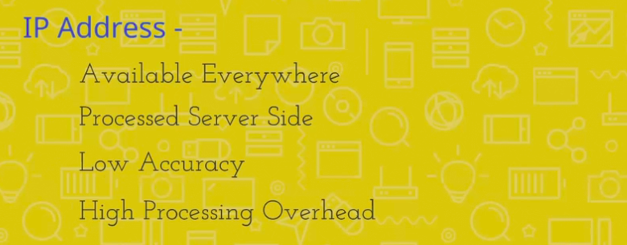
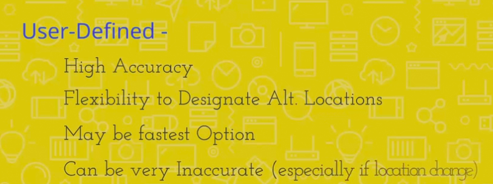
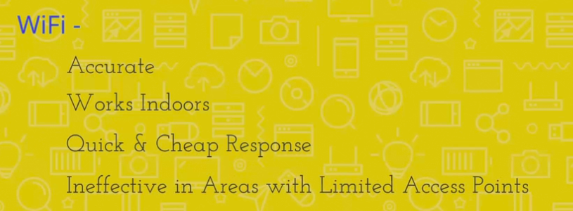
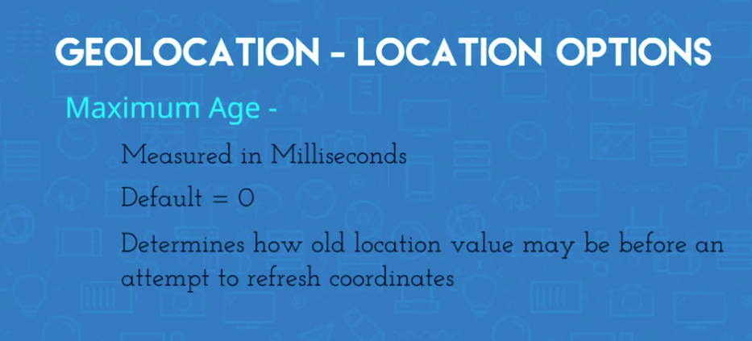
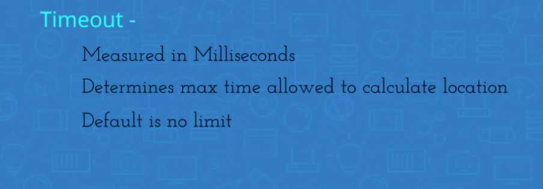
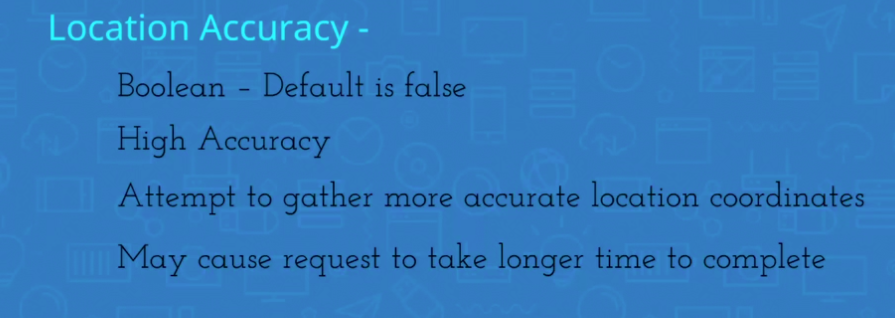

# Geolocation Introduction

# How It Works

There are various methods in which the geolocation API works which include the following.

## Cell Based

## GPS Based

## IP Based

## User Defined

## Wifi Based

# Geolocation Options

